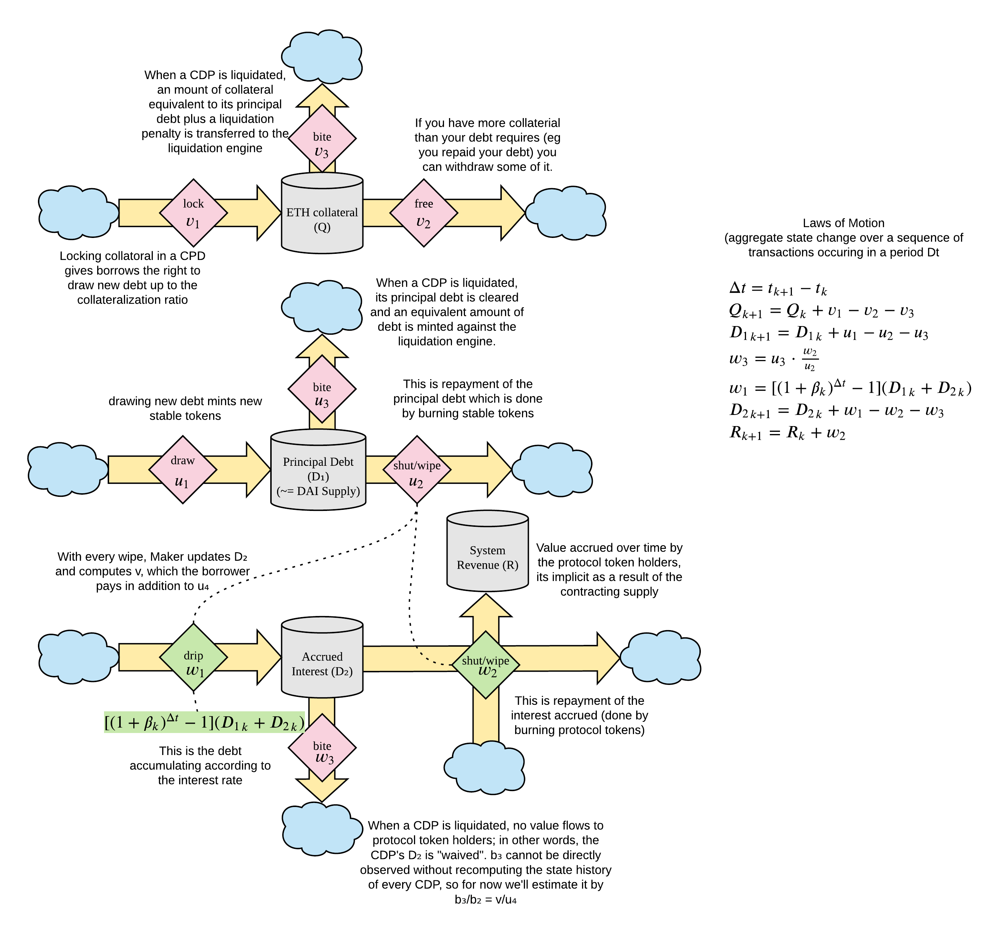

<!-- #region -->
# Glossary

**General terms**
* Reflex-index: a collateralized, non-pegged asset with low volatility compared to its own collateral
* Redemption price: the price the system wants the reflex-index to have; always stuck at 1 USD for DAI but variable for reflex-indexes
* Market price: the price that the market values the reflex-index
* Market price TWAP: The Time-Weighted Average Price of the market price
* Redemption rate: a per-second rate (which can be positive or negative) used to incentivize users to generate lever more or pay back their debt; the redemption rate gradually changes the redemption price; similar, but not identical to an interest rate.
* SAFE - A collateralized debt position (CDP) created by locking collateral in Reflex-index’s smart contract. It is essentially a decentralized loan backed by the value of the collateral.
* Proportional-Integral-Derivative (PID) controller - the most commonly implemented stability controller type in the real world, and both its modeling structure and its parameter tuning are well-researched problems.

## PID Controller
* Set point -   The set point $$p_s(t)$$ of the controller is the redemption price $$p_r(t)$$ in units of $$\frac{USD}{RAI}$$
$$
p_s(t) \equiv p_r(t) \: \forall t
$$
* Process variable -   The process variable of the controller is the secondary market price $$p(t)$$ in units of $$\frac{USD}{RAI}$$.
* Error -   The error is the difference between the set point and the process variable, in units of $$\frac{USD}{RAI}$$
  $$
    e(t) := p_s(t) - p(t) = p_r(t) - p(t).
  $$
  
* Control - The control is the rate of change of the redemption price $$p_r(t)$$ in units of $$\frac{USD}{RAI}$$
  $$
    r(t) := K_p \cdot e(t) + K_i \cdot \int_{\tau = 0}^t e(\tau) d \tau + K_d \cdot \frac{ d e(t)}{d t}
  $$
Where $$K_p$$ $$K_i$$ $$K_d$$ are the control parameters corresponding, respectively, to the proportional, integral and derivative terms.
* Output - The output of the controlled process, or system plant, is the redemption price $$p_r(t)$$
  $$
    p_r(t+\Delta t) = (1 + r(t))^{\Delta t} \cdot p_r(t)
  $$
for time interval $$\Delta t$$
* Secondary Market Price - The law of motion $$F$$ of the secondary market price $$p(t)$$ dictates the measured response of the market price to changes in the redemption price $$p_r(t)$$ and other, exogenous factors (denoted by ellipses after the semicolon):
  $$
    p(t + \Delta t) = F(p_r(t + \Delta t); \ldots)
  $$
for time interval $$\Delta t$$

## SAFE(CDP) system

**Aggregate**
* `eth_collateral` -- "Q"; total ETH collateral in the system i.e. locked - freed - bitten
* `principal_debt` -- "D_1"; the total debt in the system i.e. drawn - wiped - bitten
* `accrued_interest` -- "D_2"; the total interest accrued in the system i.e. current D_2 + w_1 - w_2 - w_3

**ETH collateral**
* `v_1` -- discrete "lock" event, in ETH; locking collateral in a SAFE gives borrowers the right to draw new debt up to the collateralization ratio
* `v_2` -- discrete "free" event, in ETH; if you have more collateral than your debt requires, you can withdraw some of it
* `v_3` -- discrete "bite" event, in ETH; when a SAFE is liquidated, an amount of collateral equivalent to its principal debt plus a liquidation penalty is transferred to the liquidation engine

**SAFE principal debt**
* `u_1` -- discrete "draw" event, in RAI; drawing new debt mints new stable tokens
* `u_2` -- discrete "wipe" event, in RAI; repayment of the principal debt by burning stable tokens
* `u_3` -- discrete "bite" event, in RAI; when a SAFE is liquidated, its principal debt is cleared and an equivalent amount of debt is minted against the liquidation engine

**Accrued interest**
* `w_1` -- discrete "drip" event, in RAI
* `w_2` -- discrete "shut"/"wipe" event, in RAI
* `w_3` -- discrete "bite" event, in RAI

